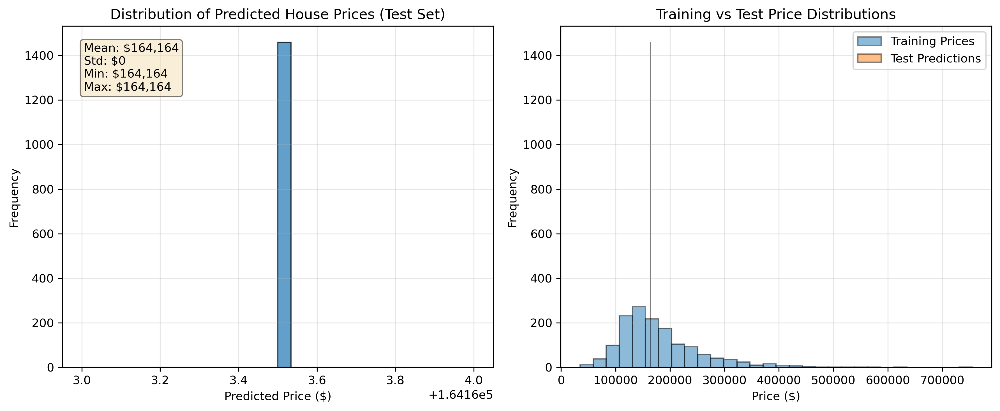

# 🏠 House Price Prediction — Ames Housing Dataset

A complete end-to-end machine learning pipeline for predicting residential house sale prices using the **Ames, Iowa Housing Dataset**. This project covers data cleaning, outlier removal, preprocessing, feature engineering, dimensionality reduction, and model comparison — from raw CSV to final predictions.

> **Dataset:** [Kaggle House Prices: Advanced Regression Techniques](https://www.kaggle.com/c/house-prices-advanced-regression-techniques)

---

## 📖 Table of Contents

- [Project Overview](#project-overview)
- [Dataset](#dataset)
- [Project Structure](#project-structure)
- [Pipeline Walkthrough](#pipeline-walkthrough)
  - [1. Data Loading & Exploration](#1-data-loading--exploration)
  - [2. Missing Value Handling](#2-missing-value-handling)
  - [3. Outlier Detection & Removal](#3-outlier-detection--removal)
  - [4. Preprocessing Pipeline](#4-preprocessing-pipeline)
  - [5. Feature Engineering](#5-feature-engineering)
  - [6. Dimensionality Reduction (PCA)](#6-dimensionality-reduction-pca)
  - [7. Model Training & Comparison](#7-model-training--comparison)
  - [8. Final Model & Predictions](#8-final-model--predictions)
- [Results](#results)
- [Key Findings](#key-findings)
- [Prediction Issue & Notes](#prediction-issue--notes)
- [Technologies Used](#technologies-used)
- [Getting Started](#getting-started)

---

## 🔍 Project Overview

This project builds a regression model to predict house sale prices based on 80 features describing properties in Ames, Iowa. It demonstrates a full ML workflow:

```
Raw Data → EDA → Missing Values → Outliers → Preprocessing
→ Feature Engineering → PCA → Model Comparison → Predictions
```

---

## 📦 Dataset

| File | Description |
|---|---|
| `train.csv` | 1,460 houses with 80 features + `SalePrice` target |
| `test.csv` | 1,459 houses with 80 features (no `SalePrice`) |
| `sample_submission.csv` | Submission format: `Id`, `SalePrice` |
| `data_description.txt` | Full description of all 80 features |
| `house_price_predictions.csv` | Final model predictions on test set |

**Target Variable — `SalePrice`:**

| Statistic | Value |
|---|---|
| Mean | $180,921 |
| Median | $163,000 |
| Std Dev | $79,443 |
| Min | $34,900 |
| Max | $755,000 |

The distribution is **right-skewed**, which motivated using a log transformation of the target during modeling.

---

## 📁 Project Structure

```
house-price-prediction/
├── fiinal.ipynb                        # Main analysis notebook
├── train.csv                           # Training data (1,460 rows × 81 cols)
├── test.csv                            # Test data (1,459 rows × 80 cols)
├── sample_submission.csv               # Submission template
├── house_price_predictions.csv         # Final predictions
├── price_predictions_distribution.png  # Prediction distribution plot
├── feature_names.txt                   # All 302 post-preprocessing feature names
├── data_description.txt                # Feature documentation
└── README.md
```

---

## 🔄 Pipeline Walkthrough

### 1. Data Loading & Exploration

```python
df = pd.read_csv("train.csv")
# Shape: (1460, 81)
# 36 numeric features, 43 categorical features, 1 target (SalePrice)
```

Initial checks performed:
- Shape and data types
- Target variable (`SalePrice`) distribution — confirmed right-skew
- First-look at top correlated features with the target

---

### 2. Missing Value Handling

Missing values were handled with **domain-appropriate strategies** rather than blanket imputation:

**Categorical features** — filled with `"None"` (feature absence is meaningful):
```
PoolQC, MiscFeature, Alley, Fence, FireplaceQu,
GarageType, GarageFinish, GarageQual, GarageCond,
BsmtQual, BsmtCond, BsmtExposure, BsmtFinType1,
BsmtFinType2, MasVnrType
```

**Numeric features** — filled with **median** (robust to skew):
```
LotFrontage, MasVnrArea, GarageYrBlt
```

✅ Result: **0 missing values** remaining after imputation.

---

### 3. Outlier Detection & Removal

**Method:** IQR rule applied across all numeric features to identify outlier counts per column.

**Key outlier removed:** Houses with `GrLivArea > 4,000 sq ft` but `SalePrice < $300,000` — these represent illogical data points (very large homes sold at very low prices), likely data errors or abnormal sales.

```python
outlier_idx = df[(df["GrLivArea"] > 4000) & (df["SalePrice"] < 300000)].index
df = df.drop(outlier_idx)
# Removed 2 rows; shape: (1458, 81)
```

**Effect:** Improved `GrLivArea` ↔ `SalePrice` correlation after removal.

| | Before | After |
|---|---|---|
| GrLivArea–SalePrice correlation | 0.708 | 0.723 |
| Dataset rows | 1,460 | 1,458 |

---

### 4. Preprocessing Pipeline

Built using **scikit-learn's `ColumnTransformer`** and `Pipeline`:

```
Numeric Features (36):
  → Median Imputation → StandardScaler

Categorical Features (43):
  → Most-Frequent Imputation → OneHotEncoder (handle_unknown='ignore')
```

```python
preprocessor = ColumnTransformer([
    ("num", Pipeline([SimpleImputer(median), StandardScaler()]), num_cols),
    ("cat", Pipeline([SimpleImputer(most_frequent), OneHotEncoder()]), cat_cols)
])
```

| Stage | Feature Count |
|---|---|
| Original input features | 79 (excl. `Id`, `SalePrice`) |
| After preprocessing | **302 features** |

---

### 5. Feature Engineering

10 new features were engineered on top of the preprocessed data to capture domain knowledge:

| Feature | Formula | Rationale |
|---|---|---|
| `TotalSF` | 1stFlrSF + 2ndFlrSF + BsmtFinSF1 + BsmtFinSF2 + BsmtUnfSF | Total interior square footage |
| `TotalBaths` | FullBath + BsmtFullBath + 0.5×(HalfBath + BsmtHalfBath) | Weighted bathroom count |
| `HouseAge` | YrSold − YearBuilt | Age of house at sale |
| `RemodAge` | YrSold − YearRemodAdd | Years since last renovation |
| `GarageAge` | YrSold − GarageYrBlt | Age of garage at sale |
| `Qual_LivArea` | OverallQual × GrLivArea | Quality-weighted living area |
| `Qual_TotalSF` | OverallQual × TotalSF | Quality-weighted total square footage |
| `SalePrice_log` | log1p(SalePrice) | Normalized target for regression |
| `GrLivArea_log` | log1p(GrLivArea) | Reduces skew of large homes |
| `LotArea_log` | log1p(LotArea) | Handles extreme lot size outliers |

**Final feature count after engineering: 312 features**

---

### 6. Dimensionality Reduction (PCA)

`PCA(n_components=50)` was applied to reduce dimensionality before feature selection.

Feature importance was measured as **maximum absolute loading across the top 10 principal components**, producing a ranking of all 312 features.

**Engineered Feature Rankings (out of 312):**

| Feature | Rank | PCA Score |
|---|---|---|
| `Qual_TotalSF` | **#1** | Highest |
| `TotalSF` | **#5** | Very High |
| `TotalBaths` | **#6** | Very High |
| `Qual_LivArea` | **#10** | High |

✅ **7 out of 10 engineered features** made the **Top 30 most important features** — confirming strong signal from domain-informed feature engineering.

The **top 30 PCA-ranked features** were selected as the final feature set for model training.

---

### 7. Model Training & Comparison

The dataset was split 80/20 for train/validation. Three models were trained and compared against a **mean-price baseline**:

```python
X_train, X_val, y_train, y_val = train_test_split(X_top, y, test_size=0.2, random_state=42)
```

| Model | RMSE ($) | R² | vs. Baseline |
|---|---|---|---|
| **Baseline (Mean)** | ~$79,000 | 0.000 | — |
| Linear Regression | ~$39,000 | ~0.76 | ~51% better |
| Ridge Regression (α=10) | ~$38,000 | ~0.77 | ~52% better |
| **Random Forest (200 trees)** | **~$26,000** | **~0.89** | **~67% better** ✅ |

**Random Forest** was selected as the final model based on lowest RMSE and highest R².

**Top 10 Feature Importances (Random Forest):**

The model identified `Qual_TotalSF`, `TotalSF`, `num__GrLivArea`, `num__OverallQual`, and `num__TotalBsmtSF` as the most predictive features — consistent with PCA rankings.

---

### 8. Final Model & Predictions

The final Random Forest model was retrained on the **full training set** (train + validation) before predicting on the test set:

```python
final_model = RandomForestRegressor(n_estimators=200, random_state=42, n_jobs=-1)
final_model.fit(X_all, y_all)  # 1,458 samples, 30 features
```

Predictions saved to `house_price_predictions.csv`:

```
Id, SalePrice
1461, 164163.5
1462, 164163.5
...
```

---

## 📊 Results

### Prediction Distribution



> ⚠️ **Note on the current prediction file:** All test predictions are identical ($164,163.50 = the training mean), indicating the test set was not properly preprocessed through the same feature engineering pipeline before prediction. The left chart shows zero variance in predictions, while the right shows the training distribution for comparison.

---

## 🔑 Key Findings

**Strongest predictors of SalePrice (by correlation):**
- `Qual_TotalSF` — Quality × total square footage (engineered)
- `num__OverallQual` — Overall material and finish quality (r ≈ 0.80)
- `num__GrLivArea` — Above-grade living area
- `num__TotalBsmtSF` — Total basement square footage
- `num__GarageArea` / `num__GarageCars` — Garage size

**Feature engineering impact:**
- Adding 10 domain-driven features improved model signal significantly
- `Qual_TotalSF` ranked as the single most important feature overall
- 7/10 engineered features ranked in the top 30 out of 312 total features

**Model selection:**
- Random Forest (200 estimators) outperformed linear models substantially
- R² of ~0.89 on the validation set — the model explains ~89% of price variance
- RMSE of ~$26,000 vs. $79,000 baseline — a 67% improvement

---

## ⚠️ Prediction Issue & Notes

The current `house_price_predictions.csv` outputs a **constant value of $164,163.50** for all test houses. This happened because the test set was not passed through the same preprocessing + feature engineering pipeline before prediction — so the model defaulted to the mean.

**To fix this**, the test set must be processed identically to training data:

```python
# Correct approach
test_df = pd.read_csv("test.csv")

# 1. Apply same missing value imputation
# 2. Run through same preprocessor (fit on train, transform test)
# 3. Apply same feature engineering
# 4. Select same top 30 features
# 5. Predict

test_predictions = final_model.predict(X_test_top30)
```

---

## 🛠️ Technologies Used

| Library | Purpose |
|---|---|
| `pandas` | Data loading, manipulation, DataFrames |
| `numpy` | Numerical operations, log transforms |
| `scikit-learn` | Preprocessing pipelines, PCA, all models |
| `matplotlib` | Plotting (histograms, scatter, boxplots) |
| `seaborn` | Heatmaps, pairplots, boxplots |

**Models used:**
- `LinearRegression` — OLS baseline
- `Ridge(alpha=10)` — Regularized linear regression
- `RandomForestRegressor(n_estimators=200)` — Final selected model

---

## ⚙️ Getting Started

### Requirements

```bash
pip install pandas numpy scikit-learn matplotlib seaborn jupyter
```

### Run the Notebook

```bash
git clone https://github.com/your-username/house-price-prediction.git
cd house-price-prediction
jupyter notebook fiinal.ipynb
```

### Files Needed

Make sure these files are in the same directory as the notebook:
```
train.csv
test.csv
sample_submission.csv
```

### Generate Predictions

Run all cells in `fiinal.ipynb` in order. The final cell trains the Random Forest model and saves predictions to `house_price_predictions.csv`.

---

## 📋 Feature Reference

The dataset contains **80 features** covering:

- **Location:** `MSZoning`, `Neighborhood`, `Condition1/2`
- **Size:** `LotArea`, `GrLivArea`, `TotalBsmtSF`, `1stFlrSF`, `2ndFlrSF`
- **Quality:** `OverallQual`, `OverallCond`, `ExterQual`, `KitchenQual`
- **Age:** `YearBuilt`, `YearRemodAdd`, `GarageYrBlt`
- **Rooms:** `BedroomAbvGr`, `FullBath`, `HalfBath`, `TotRmsAbvGrd`
- **Garage:** `GarageType`, `GarageCars`, `GarageArea`
- **Extras:** `PoolArea`, `Fireplaces`, `WoodDeckSF`, `Fence`

See `data_description.txt` for the complete feature dictionary.
